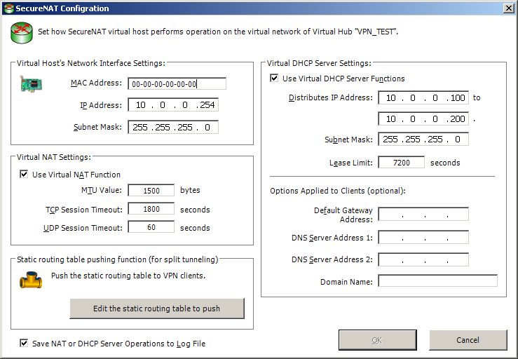
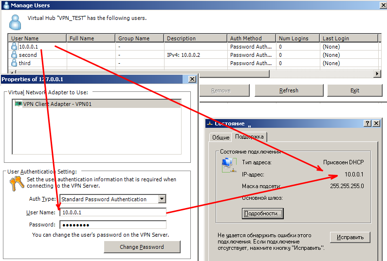
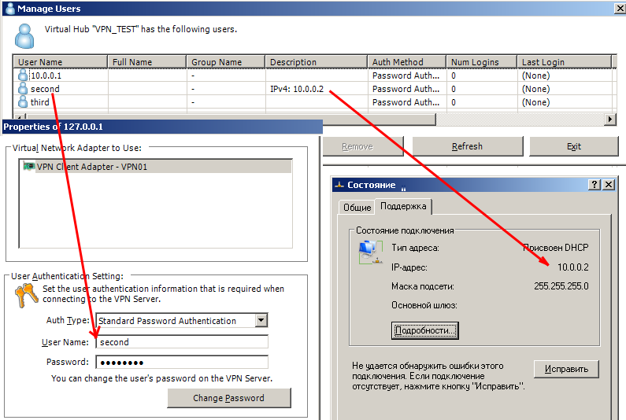
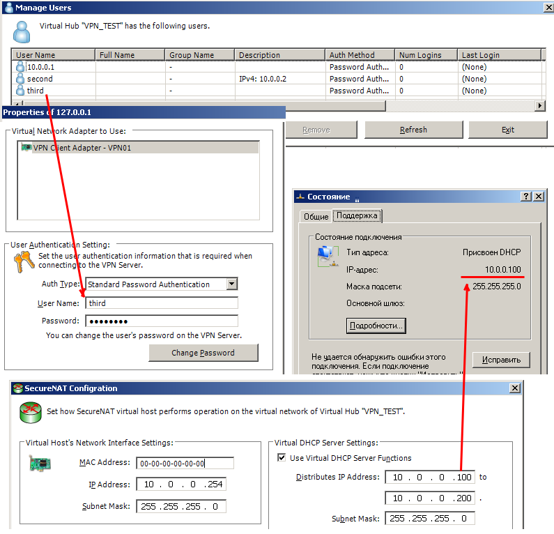
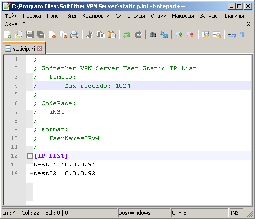

## Custom Builds

** Server

    * Static IPv4 for users by User Name

	[vpnserver-with-static-IPs-L-x86.exe](vpnserver-with-static-IPs-L-x86.exe) - L Build (Login)
	[vpnserver-with-static-IPs-L-x64.exe](vpnserver-with-static-IPs-L-x64.exe) - L Build (Login) 
		
		How to set:
			- Static IP can be set as user name (example: 10.0.0.1)   
		
		How to use:
			1) Install Original Softether VP Server
			2) Stop SoftEther VPN Server (SEVPNSERVER) service
			3) Replace original vpnserver.exe file in C:\Program Files\SoftEther VPN Server with selected from above
			4) Run SoftEther VPN Server (SEVPNSERVER) service
			5) That's All	
		
    * Static IPv4 for users by User Note

	[vpnserver-with-static-IPs-N-x86.exe](vpnserver-with-static-IPs-N-x86.exe) - N Build (Note)
	[vpnserver-with-static-IPs-N-x64.exe](vpnserver-with-static-IPs-N-x64.exe) - N Build (Note) 
		
		How to set:
			- Static IP can be set as user note (example: IPv4: 10.0.0.1) 
		
		How to use:
			1) Install Original Softether VP Server
			2) Stop SoftEther VPN Server (SEVPNSERVER) service
			3) Replace original vpnserver.exe file in C:\Program Files\SoftEther VPN Server with selected from above
			4) Run SoftEther VPN Server (SEVPNSERVER) service
			5) That's All	

    * Static IPv4 for users by User Name or User Note:
		
	[vpnserver-with-static-IPs-LN-x86.exe](vpnserver-with-static-IPs-LN-x86.exe) - LN Build (Login-Note)
	[vpnserver-with-static-IPs-LN-x64.exe](vpnserver-with-static-IPs-LN-x64.exe) - LN Build (Login-Note) 
	
		How to set:
			- Static IP can be set as user name (example: 10.0.0.1)   
			- Static IP can be set as user note (example: IPv4: 10.0.0.1) 
			* IP sets from User Name, if User Name is not IP then try to set from User Note

		How to use:
			1) Install Original Softether VP Server
			2) Stop SoftEther VPN Server (SEVPNSERVER) service
			3) Replace original vpnserver.exe file in C:\Program Files\SoftEther VPN Server with selected from above
			4) Run SoftEther VPN Server (SEVPNSERVER) service
			5) That's All	
			
	[vpnserver-with-static-IPs-NL-x86.exe](vpnserver-with-static-IPs-LN-x86.exe) - NL Build (Note-Login)
	[vpnserver-with-static-IPs-NL-x64.exe](vpnserver-with-static-IPs-LN-x64.exe) - NL Build (Note-Login)
	
		How to set:
			- Static IP can be set as user name (example: 10.0.0.1)   
			- Static IP can be set as user note (example: IPv4: 10.0.0.1) 
			* IP sets from User Note, if User Note is empty IP will try to set from User Name

		How to use:
			1) Install Original Softether VP Server
			2) Stop SoftEther VPN Server (SEVPNSERVER) service
			3) Replace original vpnserver.exe file in C:\Program Files\SoftEther VPN Server with selected from above
			4) Run SoftEther VPN Server (SEVPNSERVER) service
			5) That's All	
			
	* Static IPv4 for users from file or by User Name or User Note:
	
	[vpnserver-with-static-IPs-FNL-x86.exe](vpnserver-with-static-IPs-FNL-x86.exe) - FNL Build (File-Note-Login)
	[vpnserver-with-static-IPs-FNL-x64.exe](vpnserver-with-static-IPs-FNL-x64.exe) - FNL Build (File-Note-Login)
	
		How to set:
			- Static IP can be set by user name in staticip.ini file
			- Static IP can be set as user name (example: 10.0.0.1)   
			- Static IP can be set as user note (example: IPv4: 10.0.0.1) 
			* IP sets from staticip.ini file; if file has no records or empty - ip will set from from User Note, then from User Name

		How to use:
			1) Install Original Softether VP Server
			2) Stop SoftEther VPN Server (SEVPNSERVER) service
			3) Replace original vpnserver.exe file in C:\Program Files\SoftEther VPN Server with selected from above
			4) Run SoftEther VPN Server (SEVPNSERVER) service
			5) That's All	
			
   
   
   
   
   
